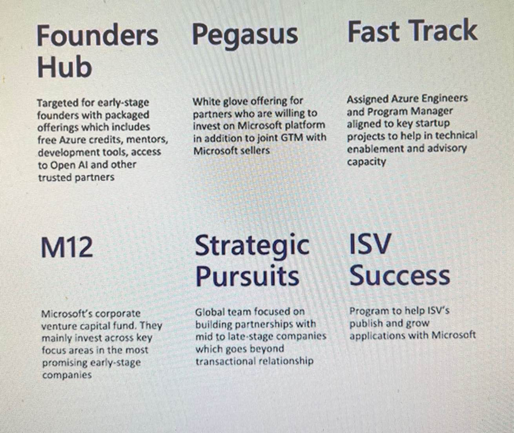

# verifiedidisv

This README is intended to provide guidance to Verified ID ISVs and in general ISVs to launch their Apps on Marketplace. It is very important for ISV to be focused on a specific persona (user vs buyer) and the positioning statements specific to each persona for their product. 

1. ISVs should work with their initial customers to get a customer story published either on their website or if possible on Microsoft website - https://customers.microsoft.com/en-us/search?sq=%22Microsoft%20Entra%20Verified%20ID%22&ff=&p=0&so=story_publish_date%20desc. This helps the Microsoft internal teams to introduce you to new customers for the specific use case for the specific vertical.

2. ISVs esp. issuers should consider being added to the Verified ID Trusted Network like ISVs here https://aka.ms/verifiedisv. The Trusted Network API (https://learn.microsoft.com/en-us/azure/active-directory/verifiable-credentials/vc-network-api) provides the means to get added to the network. Note: Some cases Microsoft may need to be contacted or this script can be useful - https://github.com/premgan/verified-id/blob/main/vc-publish-to-vc-network.ps1. This opens new venue to get in front of customers as part of their remote onboarding use cases leveraging the Microsoft Entra Ecosystem.

3. ISVs should stay up to date on latest in Verified ID related protocols and use cases here - https://www.w3.org/TR/vc-data-model/ 

4. For Education and Professional Services use cases attending and staying in touch with Industry groups like https://www.1edtech.org/

5. Sometimes when you customer is not a Azure customer, Verified ID can become the foot in the door for Microsoft sales folks. This can help engage Microsoft resources. 

6. Staying up to date on the offerings from Marketplace in Security solution area - https://partner.microsoft.com/en-us/explore/solution-areas#tab-6

7. Join the ISV success program - https://www.microsoft.com/en-us/isv/success-application. Some other programs to consider based on your needs:

